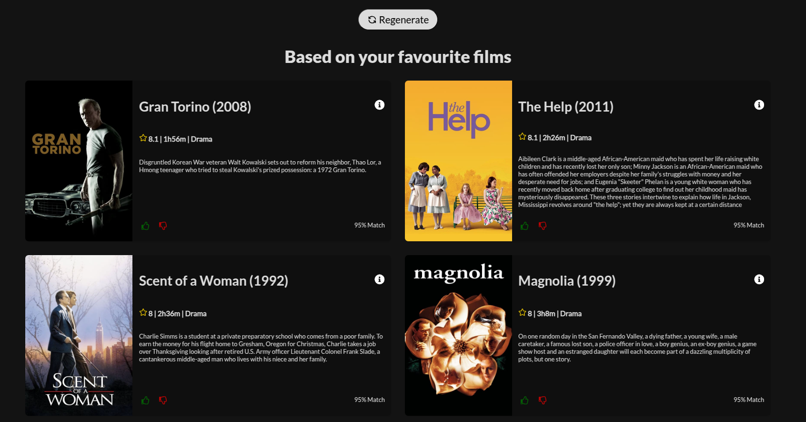
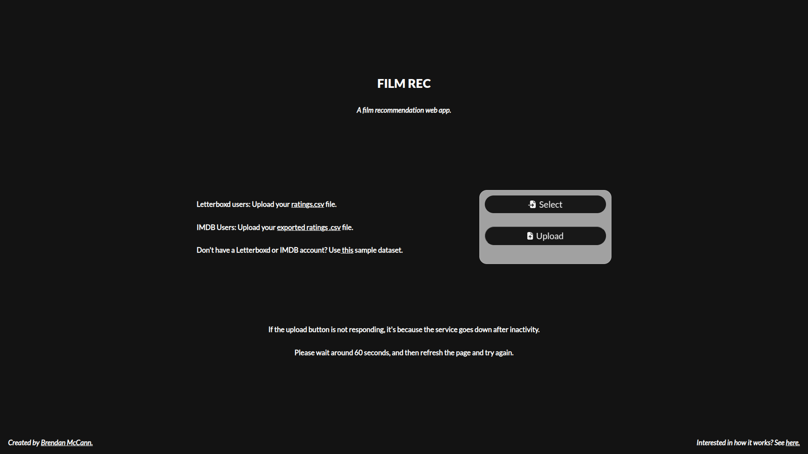

# ***[FILM-REC](https://film-rec.onrender.com/)***

A film recommendation web app. Films are recommended based on user-submitted IMDB or Letterboxd data. I built the recommendation algorithm from scratch - no external ML libraries were used. This took me over one year, and I was working on it as a side project, both for fun and learning.

Before starting the project, I was interested in ML and Data Science. I love films, so when it came to thinking about what kind of project to do, a recommendation web app was a clear intersection between these passions.

# The Recommendation Algorithm

## Background to Recommender Systems

I read the book *Recommender Systems: The Textbook by Charu C. Aggarwal* to learn about the many types of recommendation algorithms. One of which is **Content-based filtering**: recommendations are made based **solely on what the user watched.** For example, if a user liked *La La Land*, then they will be recommended romantic musical films in the 2010s. Another type of algorithm is **Collaborative filtering**: recommendations are made based on **what other users with similar taste also liked.** For example, the user will be recommended films that were also liked by people who enjoyed *La La Land*.

Each approach has their unique advantages and disadvantages, so the most sophisticated recommendation algorithms employ both techniques. Due to limitations in the data I could gather, my algorithm uses only content-based filtering.

According to Aggarwal, the most important aspects of a good recommendation system is:

* **Diversity:** Recommending many types of films, not just one.
* **Novelty:**  Recommending films the user is not aware of. Not just recommending obvious hits.
* **Serendipity:** Similar, but slightly different to novelty. Recommending genuinely unexpected, yet good films. It made a connection that you never realised yourself.
* **Trust through interpretation:** Explaining to the user why the film was recommended. For example: *"Because you liked American Romance Films"*.

## Theory

### Mathematical Representation

Every film is represented as a vector, where values range from `0` to `1.0`. The vectors have 100 dimensions: 

* 1 dimension each for `year`, `imdbRating`, `numberOfVotes` and `runtime`
* 23 dimensions for each `genre`
* 73 dimensions for each `country`

The `year` value is normalised - so the oldest film in the dataset will have a `year` value of `0.0`, whereas the newest film in the dataset will have a `year` value of `1.0`. The same is true for `imdbRating`, `numberOfVotes` and `runtime`. For example, the vectorized form of *Shawshank Redemption* will have an `imdbRating` value of `1.0` because it has the highest `imdbRating` in the dataset, and *Sherlock Jr.* will have a `runtime` value of `0.0` because it has the shortest `runtime` in the dataset.

The next 23 dimensions in the vector are reserved for `genres`, and the 73 dimensions after that are reserved for `countries`. The `countries` and `genres` of a film were converted using **one-hot encoding.** For example, *The Godfather* has crime and drama as it's `genres`, so the vector indexes associated with crime and drama will be set to `1.0`, while the other `genres` in the vector will stay at `0.0`. It is an American film, so the vector index associated with America will be set to `1.0`, and all other `countries` will stay at `0.0`.

Below you will find a concrete example of *12 Angry Men* being vectorized:

```java
[
    0.38, // year: 1957
    0.96, // imdbRating: 9.0
    0.29, // numberOfVotes: 913,000
    0.13, // runtime: 96m
    0.0,  // Action
    0.0,  // Adventure
    ...
    1.0,  // Crime
    1.0,  // Drama
    ...
    0.0,  // Western
    0.0,  // Algerian
    1.0,  // American
    0.0,  // Angolan
    ...
    0.0   // Yugoslavian
]
```

> In reality, the attributes of the film are weighted differently according to their significance: `year` is a value between `0.0` and `0.5`, `imdbRating`, `numberOfVotes` and `countries` between `0.0` and `1.0`, `runtime` between `0.0` and `0.3` and `genres` between `0.0` and `0.7`. I omitted this from the example to keep things simple, but it's worth noting.

### Positive Preference Weighting

On IMDB and Letterboxd, users rate films on a scale of 1-10. We want our recommendation system to be **strongly influenced** by films that the user **liked most,** and **less influenced** by films that the user **did not like**. Let's suppose you rated *The Dark Knight* 8/10, and *Iron Man* 4/10. In the user dataset, the vector that represents *The Dark Knight* will be scalar multiplied by `0.8`, whereas the vector that represents *Iron Man* will be scalar multiplied by `0.4`. This ensures that the qualities of *The Dark Knight* will have more influence on the recommendation algorithm than the qualities of *Iron Man*.

Continuing on from the previous example, let's suppose you rated *12 Angry Men* an 7/10.
Afterwards, the vectorized form of the film will look as shown below:

```java
[
    0.27,  // year:          0.27 = 0.7 * 0.38
    0.67,  // imdbRating:    0.67 = 0.7 * 0.96
    0.20,  // numberOfVotes: 0.20 = 0.7 * 0.29
    0.09,  // runtime:       0.09 = 0.7 * 0.13
    0.0,   // Action:        0.0  = 0.7 * 0.0
    0.0,   // Adventure:     0.0  = 0.7 * 0.0
    ...
    0.7,   // Crime:         0.7  = 0.7 * 1.0
    0.7,   // Drama:         0.7  = 0.7 * 1.0
    ...
    0.0,   // Western:       0.0  = 0.7 * 0.0
    0.0,   // Algerian:      0.0  = 0.7 * 0.0
    0.7,   // American:      0.7  = 0.7 * 1.0
    0.0,   // Angolan:       0.0  = 0.7 * 0.0
    ...
    0.0    // Yugoslavian:   0.0  = 0.7 * 0.0
]
```

### Time Weighting

User preferences change over time. A good recommendation algorithm places more value on **recent** ratings over **older** ones. For example, let's say you gave *Whiplash* a 9/10 three years ago (the oldest rating in your dataset), and yesterday you gave *Parasite* a 9/10. The films in the user dataset are scalar multiplied by a value between `0.8` and `1.0`. So, the vector that represents *Whiplash* will be scalar multiplied by `0.8`, whereas the vector that represents *Parasite* will be scalar multiplied by `1.0`.

Continuing on from the same example, let's suppose your 7/10 rating of *12 Angry Men* was the oldest rating in your dataset.
Afterwards, the vectorized form of the film will look as shown below:

```java
[
    0.22,  // year:          0.22 = 0.7 * 0.8 * 0.38
    0.54,  // imdbRating:    0.54 = 0.7 * 0.8 * 0.96
    0.16,  // numberOfVotes: 0.16 = 0.7 * 0.8 * 0.29
    0.07,  // runtime:       0.07 = 0.7 * 0.8 * 0.13
    0.0,   // Action:        0.0  = 0.7 * 0.8 * 0.0
    0.0,   // Adventure:     0.0  = 0.7 * 0.8 * 0.0
    ...
    0.56,  // Crime:         0.56 = 0.7 * 0.8 * 1.0
    0.56,  // Drama:         0.56 = 0.7 * 0.8 * 1.0
    ...
    0.0,   // Western:       0.0  = 0.7 * 0.8 * 0.0
    0.0,   // Algerian:      0.0  = 0.7 * 0.8 * 0.0
    0.56,  // American:      0.56 = 0.7 * 0.8 * 1.0
    0.0,   // Angolan:       0.0  = 0.7 * 0.8 * 0.0
    ...
    0.0    // Yugoslavian:   0.0  = 0.7 * 0.8 * 0.0
]
```

### Profiles

Now, a user's films have been vectorized and weighted according to their liking of the film and how recent they rated it. We need some way to aggregate their preferences into a **profile**, and then recommend films similar to that profile. In our case, the profile will also be a 100-dimensional vector with the same features: year, `imdbRating`, `numberOfVotes`, `runtime`, `genres` and `countries`.

Mathematically, this can be achieved by taking a **weighted average** of all the vectors in the user dataset, and aggregating the results into one vector. This is known as a **user profile**: one vector to rule them all. Theoretically, this sounds ideal, but in reality, the recommendations were not diverse, and in my testing I found that only one type of film was being recommended to the user. For example, with my user data, only Drama films were being recommended.

### Diverse Recommendations

Rather than just relying on one profile, I utilised multiple profiles to provide diverse and novel recommendations:

* **Favourites Profile:** Aggregate only films that the user has rated a 9/10 or 10/10.
* **Recents Profile:** Aggregate only films that the user has rated in the last 30 days.
* **Genre Profiles:** Aggregate 23 profiles: 1 for each genre, and then choose the top 3 with the highest mean rating.
* **Internationals Profile:** Use the user profile, but set the American and British vector values to `0.0` and scale up the other `countries`.
* **Oldies Profile:** Use the user profile, but set the year vector value to `0.0`.

### Similarity Measure

We know have multiple profiles, but to actually recommend films, we need a similarity measure. Since the films are represented using vectors, **cosine similarity** was the clear choice.

Let's take the **favourites profile** as an example: this vector is compared (using a cosine similarity calculation) with every unseen film in the dataset, the films are ranked by similarity and the top 6 films are chosen as recommendations. This process is repeated for all the other profiles: recents, international, etc.

### Reinforcement Learning

Users can react to a given recommendation through a thumbs up/down feature. What we want is that when a user gives a **thumbs up**, it **strengthens** the qualities that recommended the film, and likewise **weakens** the qualities with a **thumbs down.**

To give an example: let's suppose the year value of the favourites profile is `0.4`: this translates to the year 2003. Based on this profile, we recommend *The Dark Knight*, released in 2008 with a year value of `0.42`. If the user gives a thumbs up to this recommendation, the year value of the profile will move 20% towards the year value of the recommendation. In this example, the year value of the profile will move from `0.4` to `0.404`.

### Regeneration

After a user has responded to some of their recommendations, they have the ability to completely regenerate recommendations. The new recommendations will factor in their positive and negative feedback of the previous recommendations.

### The Final Result



# Project Architecture

## Data Retrieval

IMDb provides a public dataset of every movie, TV show, episode, short-film - you name it. I configured a shell script that downloads these datasets, filters out only films with >=25,000 votes and >=40 minute runtime. These datasets only contain basic information about a film: `title`, `year`, `imdbRating`, `numberOfVotes`, `runtime` and `genres`. In order to obtain more information about the film, I call the TMDb API service to find the relevant films in the dataset, and augment them with `countries`, `summary` and `poster`. Since the free TMDb service is rate limited, the responses are cached so no redundant calls are made.

We know have a dataset of films stored in a `.json` file. Below, you'll find an example of how a film is stored:

```json
"tt0050083": {
    "title": "12 Angry Men",
    "letterboxdTitle": "12 Angry Men",
    "year": 1957,
    "letterboxdYear": 1957,
    "imdbRating": 9.0,
    "numberOfVotes": 913170,
    "runtime": 96,
    "runtimeHoursMinutes": "1h36m",
    "genres": [
        "Crime",
        "Drama"
    ],
    "imdbUrl": "https://www.imdb.com/title/tt0050083",
    "countries": [
        "American"
    ],
    "poster": "https://image.tmdb.org/t/p/w500/ow3wq89wM8qd5X7hWKxiRfsFf9C.jpg",
    "summary": "The defense and the prosecution have rested and the jury is filing..."
}
```

> In order to make my web app compatible with IMDb and Letterboxd, I had to additionally store the Letterboxd `title` and Letterboxd `year` of the films, because in some rare cases they differ between the platforms - and yes, this was a headache.

## Backend

The backend was powered by Python Flask, allowing API endpoints to be exposed to the frontend. The service was deployed using [render](https://render.com/).

In recommender systems, there is an immense amount of computation involved in generating recommendations. As a result, the computation can be divided into two phases:

* **Online Phase:** Any computation that **must** be done on the fly. This generally occurs as the user is interacting with the system in real time.
    * For example: when a user uploads their film data, their data is processed in real-time. It's not possible to do this computation at another time.
    * You want as little computation as possible in this phase, in order to make the experience seamless and efficient for the end-user.
* **Offline Phase:** Any computation that can happen when the user isn't interacting with the system.
    * For example: the film dataset can be generated once every 24 hours. It doesn't **need** to be regenerated everytime a user queries their recommendations.
    * You want as much of your computation as possible in this phase, in order to lighten the load of the online phase.

## Frontend

The frontend was designed using React JS. I wanted a sleek and minimalist design. Below is the home page:



# How to test locally

* Clone the repository and checkout to the `local-deployment` branch.
* Open 2 instances of the terminal. We will download dependencies and run both the frontend and the backend.
* In one terminal, run the following commands for the backend.
    ```sh
    $ cd backend/
    $ pip3 install -r requirements.txt
    $ python3 app.py
    ```
    * note: `pip` instead of `pip3` may work
    * or also `python` instead of `python3`
* In the other terminal, run the following commands for the frontend.
    ```sh
    $ cd frontend/
    $ npm install
    $ npm start
    ```
* npm should open the front page in localhost
    * If not, try go to [localhost:3000](http://localhost:3000)

# Acknowledgements

I want to thank my older brother for his guidance and advice, particularly in the early stages of development. He gave me many insightful ideas regarding the recommendation algorithm.

I would also like to thank my friends for sending me their Letterboxd data. This was a great help when testing the results of my recommendations, and allowed me to make the recommendations as good as I could.
